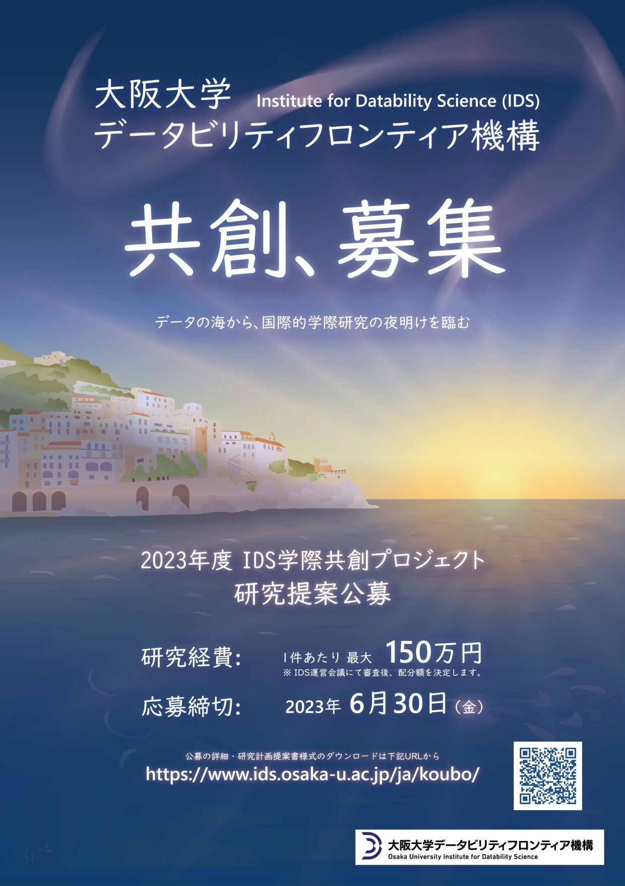

## 2023年度 研究提案公募のご案内
---
**データビリティフロンティア機構(IDS)** では、これまでの科学技術・学術分野の枠にとらわれない新たな研究の展開を目指し、データ駆動型の学際共創研究を推進してきました。

その基盤として、[IDS専任／兼任研究者](https://www.ids.osaka-u.ac.jp/ja/people/) と学内他部局研究者との連携の強化を図るとともに、部局の枠を越えた独創的な学際共創研究を支援するため、2018年度より **「IDS学際共創プロジェクト」** として研究活動費の配分を実施しています。

この度、 **2023年度「IDS学際共創プロジェクト」研究提案の募集** を行います。  
学内の幅広い分野の研究者のみなさまにご応募いただけますよう、お願い申し上げます。

詳細については、[公募要項](call2023.pdf) および [研究提案の公募について](guidance2023.pdf) をご参照ください。
 
 

### ■ 対象

IDS専任／兼任教員、および学内他部局の教員より構成される学際共創研究グループ

### ■ 研究経費

1件あたり上限 150万円 
<small>　※ IDS運営会議にて審査後、配分額を決定します。</small>

### ■ 応募締切

2023年6月30日（金）

### ■ 応募様式

下記の様式をダウンロードし、公募要項に従って研究計画提案書をご作成ください。

* [公募要項](call2023.pdf)
* [研究提案の公募について](guidance2023.pdf)
* [研究計画提案書様式](format2023.docx)

### ■ 応募方法

研究計画提案書をメール添付にて下記までご送付ください。

* 研究計画提案書提出先：  
**研究推進部研究機構振興課会計係 データビリティフロンティア機構担当** 
[ids@ml.office.osaka-u.ac.jp](mailto:ids@ml.office.osaka-u.ac.jp)  
<small>
メール件名は「**【IDS】2023年度 学際共創プロジェクト応募** 」 としてください。
</small>

### ■ スケジュール
<table style="text-indent:1em;">
  <tr>
    <td>応募締切</td>
    <td>2023年6月30日</td>
  </tr>
  <tr>
    <td>採択決定</td>
    <td>2023年8月中を予定</td>
  </tr>
  <tr>
    <td>活動費配分</td>
    <td>2023年9月以降を予定</td>
  </tr>
  <tr>
    <td>研究期間</td>
    <td>2023年度末まで</td>
  </tr>
</table>

### ■ お問い合わせ

本公募に関するお問い合わせ、IDS専任／兼任教員との研究マッチングのご相談等は

 [IDS企画室](mailto:contact@ids.osaka-u.ac.jp) までご連絡ください。

